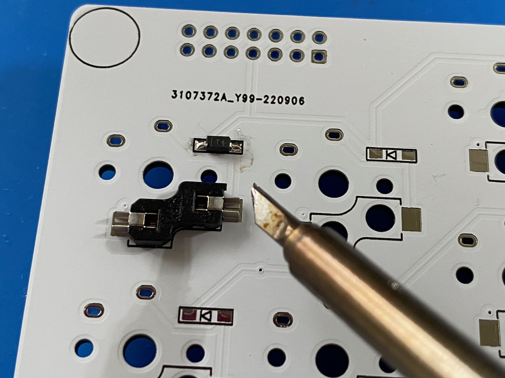
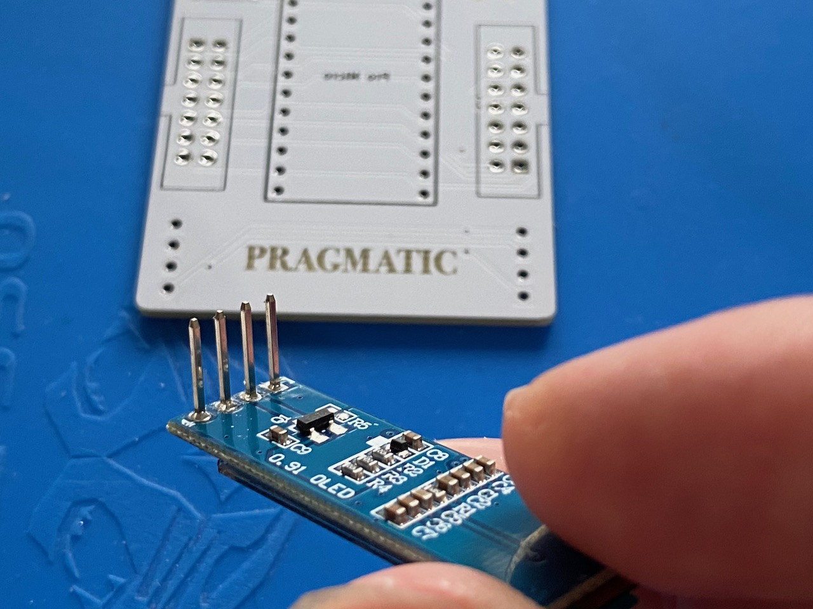
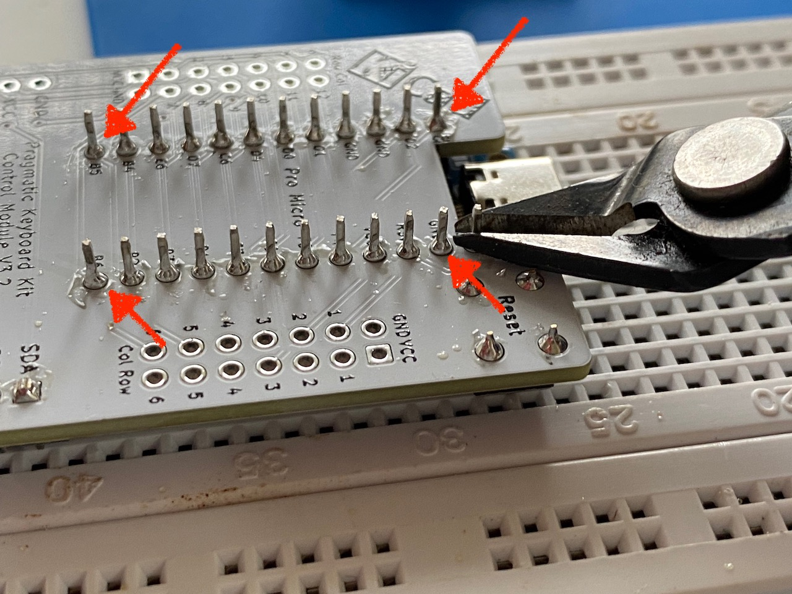

# 務實34組裝說明

你需要一下工具
- 鑷子
- 斜口鉗
- 烙鐵
- 橡皮筋一條

預估時間約90分鐘可以完成。

# 手板的焊接

1. 在二極體腳位右邊(紅色箭頭處)的焊點加上一些焊錫。

2. 擺上二極體並確認方向。二極體有方向性，元件上有一條直槓(紅色箭頭)，請跟圖示(綠色箭頭)保持同一方向。

3. 用鑷子固定，先焊一邊。

4. 再焊另外一邊。登登，你就完成一個二極體了。接下來把剩下的33個二極體都焊起來吧。要注意，大部分的二極體都是直桿在右邊，但是少數上直槓在左邊，焊接前請注意。

5. 接下來焊接熱插拔座吧。先把它依照圖示放好。

6. 將兩邊焊上。注意，要看到焊錫同時吃到熱插拔座與電路板上。如下圖有爬錫的現象就對了。如果沒焊好，最後可以再回來補焊，沒關係。一樣反覆操作33次。這時候是不是覺得鍵盤很小很好啊。

7. 接下來就是要焊接牛角接頭。要注意凹槽圖示(紅色箭頭)與接頭上的凹槽(綠色箭頭)方向要一致。插入後翻面。

8. 祕技出現了。將另外一個牛角接頭放在紅色箭頭處，此時鍵盤就是平的，等一下焊接時就不會歪了。將14個點焊上。

9. 拿出鑷子，把防滑豆豆貼到鍵盤四周(黑色圈圈處)，達到最好的防滑效果。

10. 拿出外殼，把焊好的電路板卡上去。恭喜你完成一片手板，喝口水，看看遠方，然後從步驟一再來一次。

# 主控版的製作
## OLED的焊接
1. (可省略)先把OLED針腳上面的塑膠墊片(紅色箭頭)拆除，這樣可以降低OLED的高度。如果覺得麻煩可以跳過。

拆起來以後像這樣。

2. 插入後主控版，要注意方向，針腳(紅色箭頭)在左。

3. 祕技二：逆焊法。將主控版直立起來大約60˚，讓OLED自然垂下，這樣會最好對齊。焊紅色箭頭那一支腳就好。看一下OLED板是不是跟主控版是平行的，如果歪太多會卡到牛角母座。

 
4. 將多出來的排線剪掉。

5. 完成圖。

## 重置鍵與開發版
1. 先將按鈕插入紅色箭頭處，這按鈕是長方形的，如果第一次插不進去，轉90˚再插一次即可。插入後就會自動卡住，不會掉下來。

2. 拿出14P的針腳，短頭朝上。 

3.  祕技三：橡皮筋固定法。把開發板反過來放上去，用橡皮筋綁起來固定。從側面看看有沒有歪，稍微調正一下讓各針腳都是直的。

4. 先焊四個角落，紅色箭頭處。其他點先不要焊，焊完後翻面。

5. 後面也是先焊四邊，紅色箭頭處。焊好四角以後，把橡皮筋拆掉，然後把所有的點都焊起來，正反兩面都要喔。焊後，再把多出來的針腳剪掉。

6. 完成圖。

## 牛角母座
1. 快要完成了。依照凹槽方向放入兩個牛角母座，兩個缺口都是朝外。小知識，牛角母座的英文叫做IDC connector是80年代常見的連結電子儀器的方式。

2. 翻到背面依序焊起來即可。完成以後，檢查(欣賞)一下是不是每個點都有焊到。

## 完成圖

恭喜你打造了一把自己的鍵盤。

# Troubleshooting
