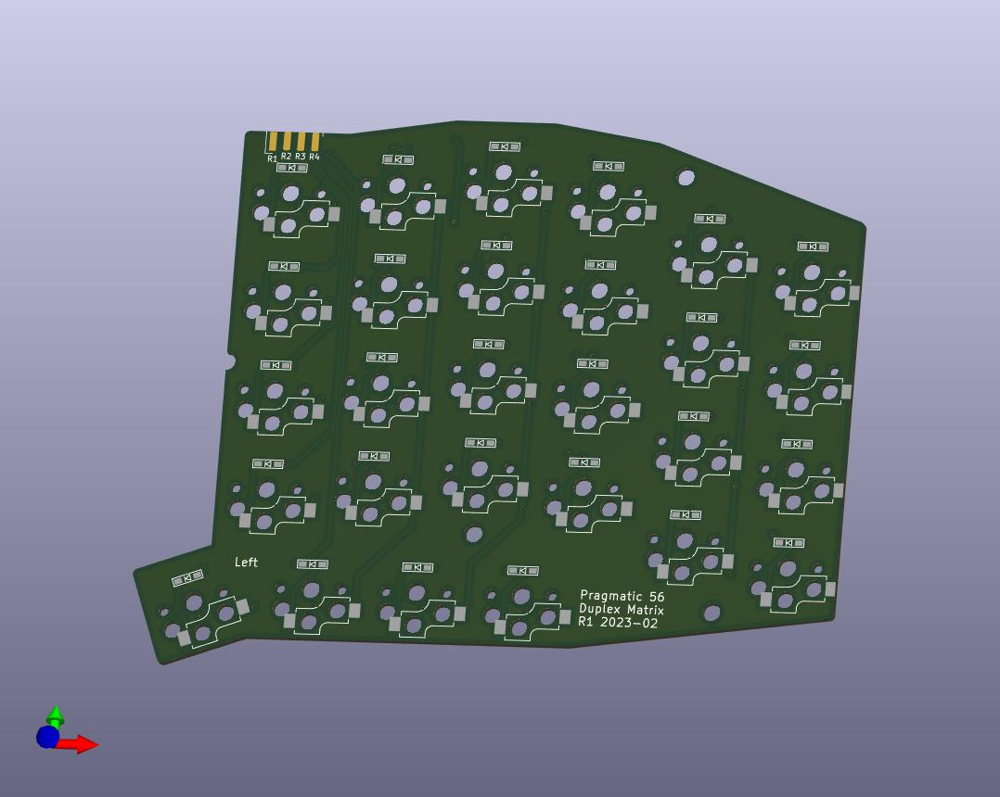
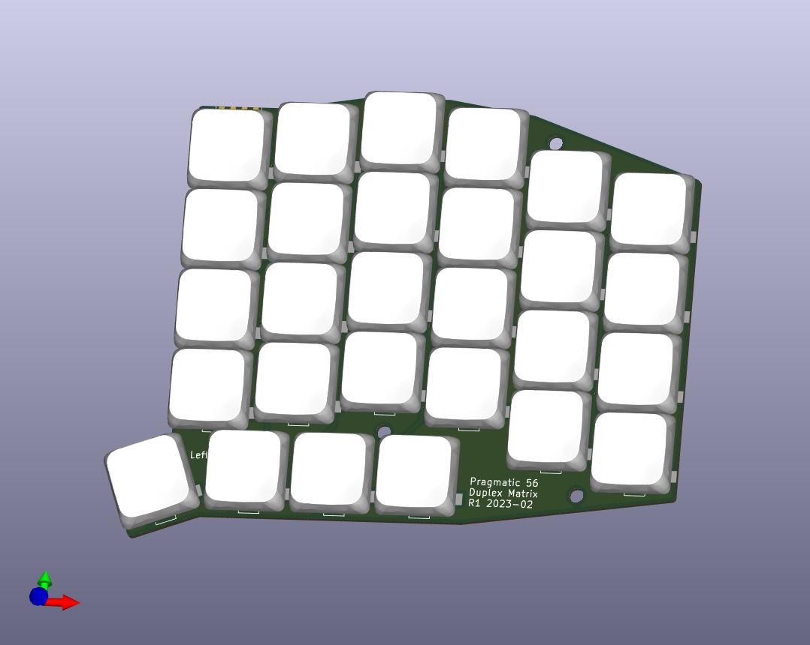

The Pragmatic56 keyboard features

- 28 keys per hand with a fully symmetric double side design. One side is designed for the left hand and the other for the right.
- Duplex Matrix to save pins.
-  8-pin connector that utilizes a user-friendly 2x4 2.54mm PinHeader.
- Support Kailh hotswap sockets.
- A compact key arrangement with a 19mm x 18mm pitch and an 18mm vertical pitch that reduces fingers need to travel distance.

Current status: Validating.

