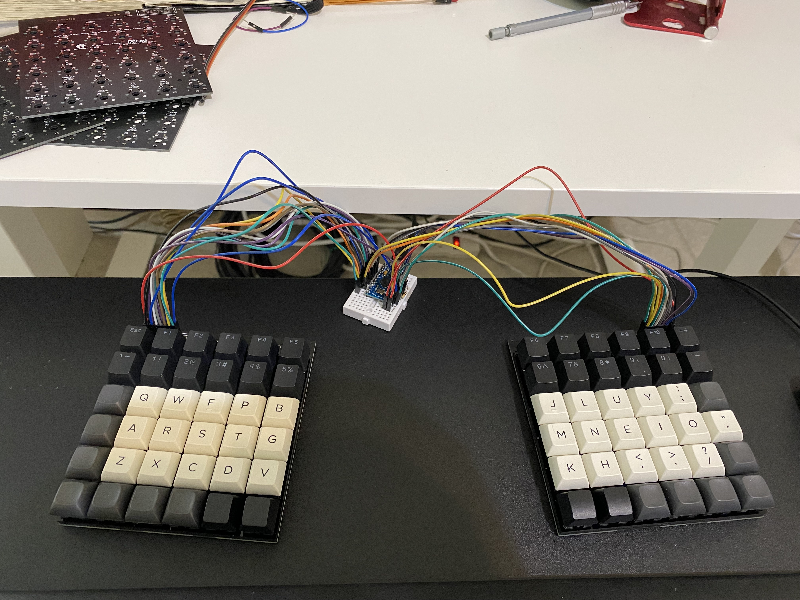
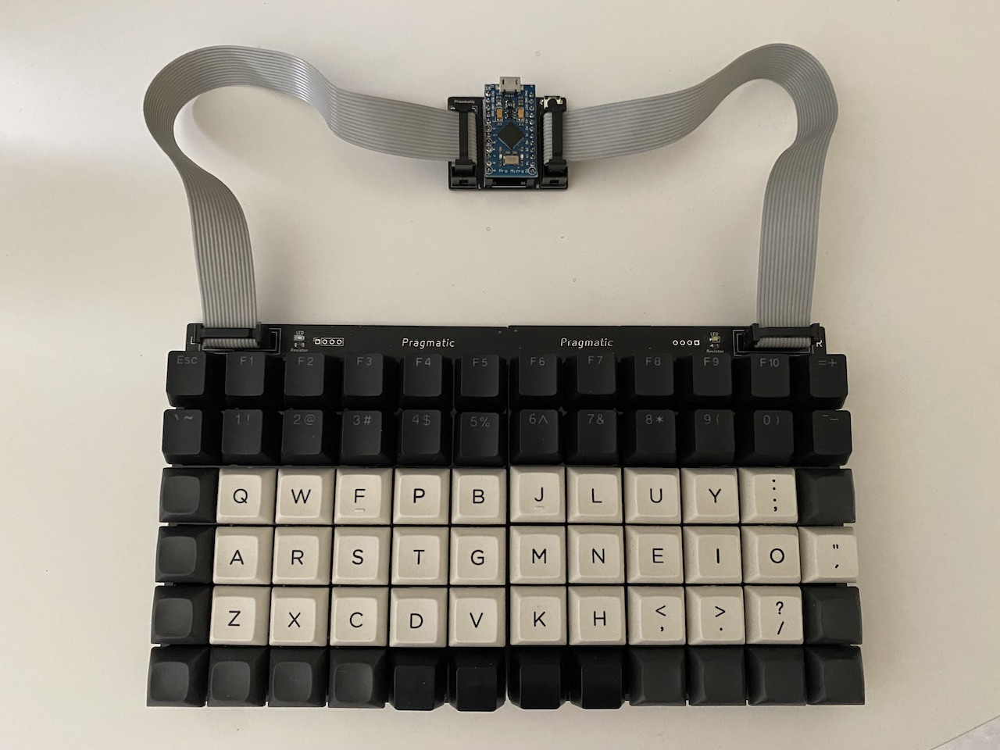

# Pragmatic Keyboard Kit

**Pragmatic 務實鍵盤** 是一把72鍵的分離式鍵盤，有數字列，有方向鍵與功能列。支援VIAL與QMK，輕鬆調整鍵盤配置，是分離式鍵盤的基本款。

## 務實主義

本套件的開發將會務實的採用[敏捷流程](http://theleanstartup.com)，每次都發佈最小可行硬體套件，然後讓大家一起討論，看看如何讓這個鍵盤變得更好用。

換言之，這將是一把大家一起設計的鍵盤，而設計的原則就是「 **務實** 」，只加入使用的功能，降低開發的時間與成本；使用最少的硬體，達到最好的效果。

為什麼會想做這個鍵盤呢？因為從兩年前，陳涵宇大大介紹的[Ergodox EZ](https://www.facebook.com/groups/1111882339005914/posts/1187639851430162)還有李松錡大大做的[ExDactyl](https://www.ergokb.tw/blogs/free_trial_exdactyl/)讓我陷入人體工學鍵盤的不歸路。
在嘗試了超多款鍵盤與超級多的[人體工學研究](https://youtu.be/p7gZdOTpbP8)之後，上週我無意間試做了分離式鍵盤的始祖直排[Let's split](https://github.com/nicinabox/lets-split-guide)，不得了！！！這實在太好用了，**務實，一整個好用。**

首先直排讓手指可以**自然的上下移動，減少手指的負擔**，讓使用者不會過勞。分離式鍵盤可以顯著改善腰酸背痛的辦公室症候群。自己改用了分離式鍵盤以後，背痛就減輕八成(個人經驗)。

**總鍵數達到72個，但是使用的空間卻比60%鍵盤還小**，實在是太神奇了。因此我才會想要開啟這個專案。

本身我是一個很環保的人，買東西都自備購物袋，洗個PCB板都會確認30次，生怕拉錯線路就浪費了資源。加上全球積體電路缺貨，兩年前可以隨便買到的IC，現在漲了三倍還要一年後才能夠交貨。因此想做一個務實的設計，**用最少的晶片消耗最少的資源來做分離式鍵盤**。不同於一般的分離式鍵盤需要兩個控制板，**Pragmatic 務實鍵盤** 只需要用到一個控制板，要來挑戰史上最務實的分離式鍵盤。

**Pragmatic 務實鍵盤**是100%開源的，全程使用開源電路軟體KiCad設計，讓大家可以隨意改出符合自己需求的版本。要實踐一把務實鍵盤，需要以下的材料：

- 務實鍵盤電路板套組，如上圖：
  - 電路板 * 3片：主控、左手、右手。
  - 壓克力定位板 * 2片
  - 消音泡棉 * 2片
  - 排線 * 2條

- [Pro Micro 5V/16MHz](https://www.sparkfun.com/products/12640)或相容的開發板（會開[Elite C](https://ergotaiwan.tw/product/elite-c_v4/)團購）
- 72顆你喜歡的軸（可以開圖）
- 鍵帽（如果達標就可以來圖購）
- 願意打破傳統的心（對，我就是在說你吧？！）

## 功能

本鍵盤套件功能

- 支援櫻桃三腳軸 MX 、五腳軸與凱華矮軸 Choc。
- 特製實心結構，聲音厚重，消除尖銳回音。
- QMK韌體，預設內建VIAL，免重新燒錄！快速自定義！
- 容易焊接，初學者可輕鬆入門

## 成團條件

- (達成)10人成團，你的名字將會刻在PCB上。
- (快要達標了)超過20人，解鎖定位板套件與大家一起動手做工作坊。 
- 超過30人的話，解鎖特製鍵帽套件。

加入[Telegram群組](https://t.me/joinchat/qp7NLK_H0vY2MjA1)即可入團

## FAQ

1. **拇指好按嗎？**
   - 內行人，其實我的右手很弱，打字一整天右手就會開始痛。然後我開始做鍵盤配置與手的解剖學研究，才發現到拇指不應該大量使用
   
2. **分離式鍵盤會不會很難適應？**
   - 老實說，這絕對不是一天就可以適應的，但是[鍵人谷](https://www.facebook.com/groups/1111882339005914)太多人換過鍵盤了，都可以提供很多方法。我自己會建議每天[keybr.com](keybr.com)練習15分鐘，慢慢打，求正確度，不用擔心速度。一到兩週就可以上手了，從此人生就改變了?!
   
3. **在咖啡廳使用會被搭訕嗎？**
   - 我不知道為什麼你要這麼問。但是我們也做了一個抽樣調查，正妹/天菜受訪者表示會想要瞭解這個新奇的鍵盤，而不是使用者別擔心。
   
4. **可以改鍵盤配置嗎？**
   - 本鍵盤將會支援支援[QMK](https://qmk.fm)，讓你為所欲為。
   
5. **完全沒有電子經驗可以自己做鍵盤嗎？**
   - 這次的套件就是要大幅減少焊接的數量，最適合初學者了。但請注意自身安全！ 
   
6. **有支援矮軸的可能嗎？**
   - 支援。
   
7. **可以不要F列嗎？**
   - 本專案都是開源的，你可以直接修改電路圖，想要什麼配置都可以。
   
8. **有熱插拔嗎？**
   - 沒。 
   
## 安裝說明
1. 依照下圖順序排列

2. 接線方式

## Vial使用方式

1. 下載[Vial](https://get.vial.today)
2. 下載[設定檔](https://github.com/jamessa/qmk_firmware/raw/jsa/keyboards/pragmatic/keymaps/vial/vial.json)。*按<kbd>Control</kbd>+滑鼠主鍵另存新檔即可。*
3. 開啟「Vial」，選擇「File」>「Sideload VIA JSON...」
4. 然後選取剛剛的設定檔，就可以開始修改配置了。t

## Inspired by

- [34 key layout](Seniply https stevep99 github io seniply by Stevenp99)
- [Let's split](https://github.com/nicinabox/lets-split-guide)
- [GH36](https://geekhack.org/index.php?topic=61306.0)
- [Nyquist/Levison Keyboard](https://keeb.io/products/nyquist-keyboard)
- Xah lee [Why function keys are useful!](http://xahlee.info/kbd/keyboard_function_keys.html)
- Quasimode https://en.wikipedia.org/wiki/Mode_(user_interface)
- Mode slips and low discoverability. https://www.nngroup.com/articles/modes/

## 想知道更多

[臉書討論](https://www.facebook.com/groups/1111882339005914/posts/1790356644491810) 或 加入[Telegram群組](https://t.me/joinchat/qp7NLK_H0vY2MjA1)

## Changelog

- V0.4 改回ProMicro腳位，增加相容性。
- V0.3 改為Elite-C腳位，重新定義IDC connector的腳位。 
- V0.2 改為雙面版。
- V0.1 開始。