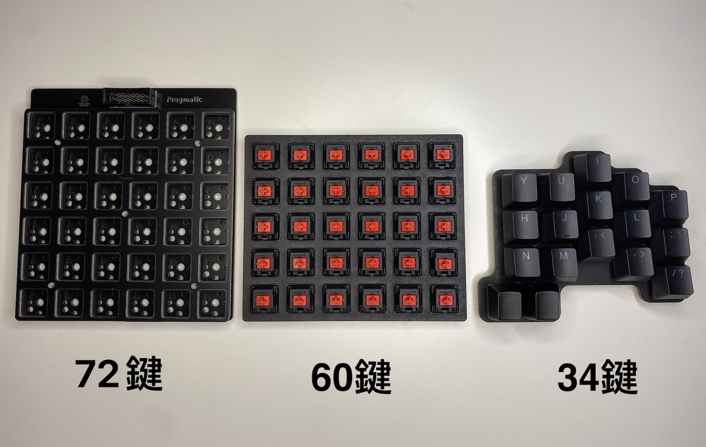
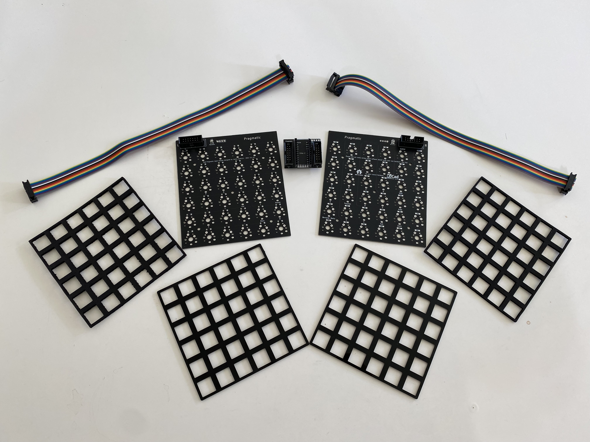
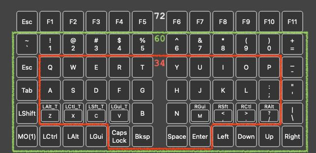
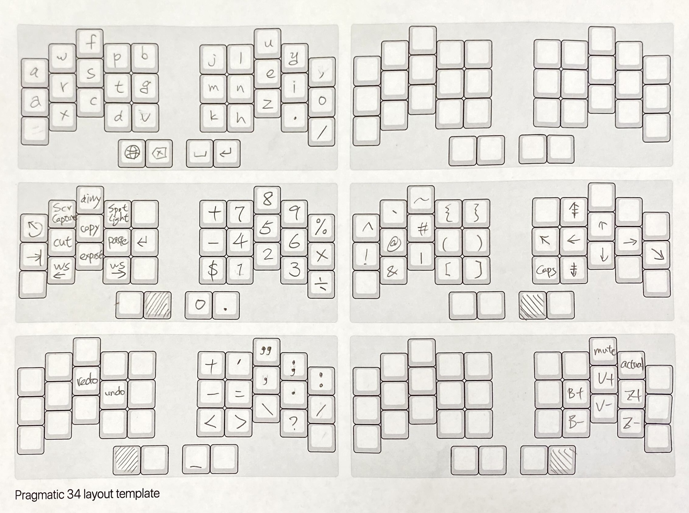
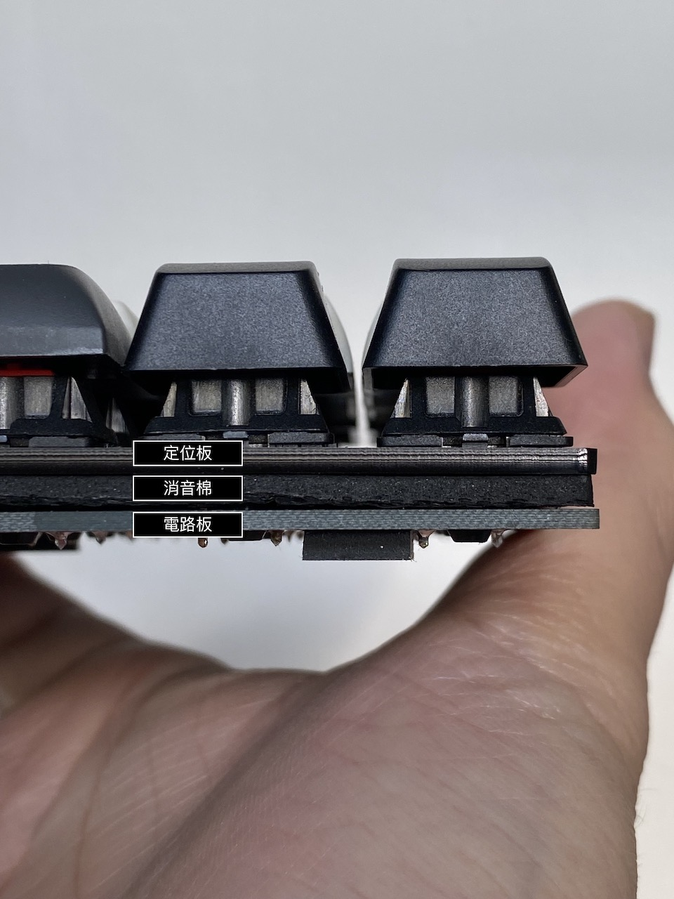
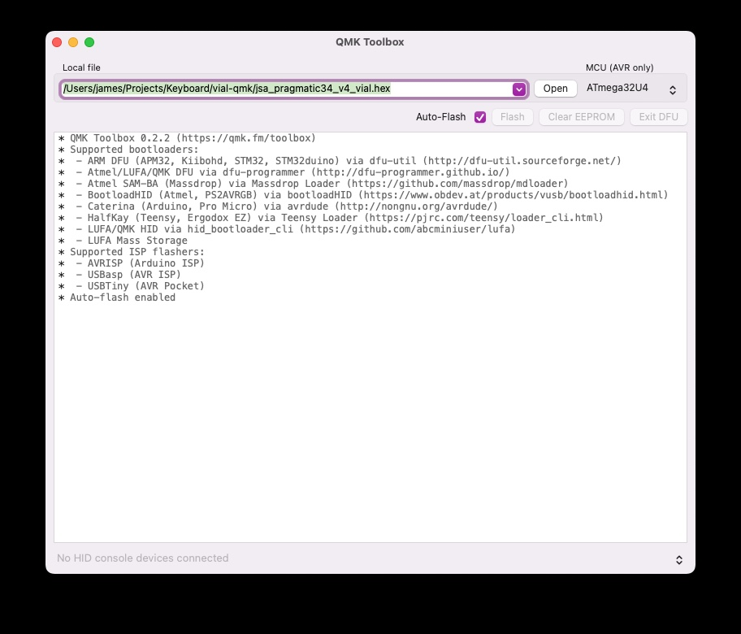
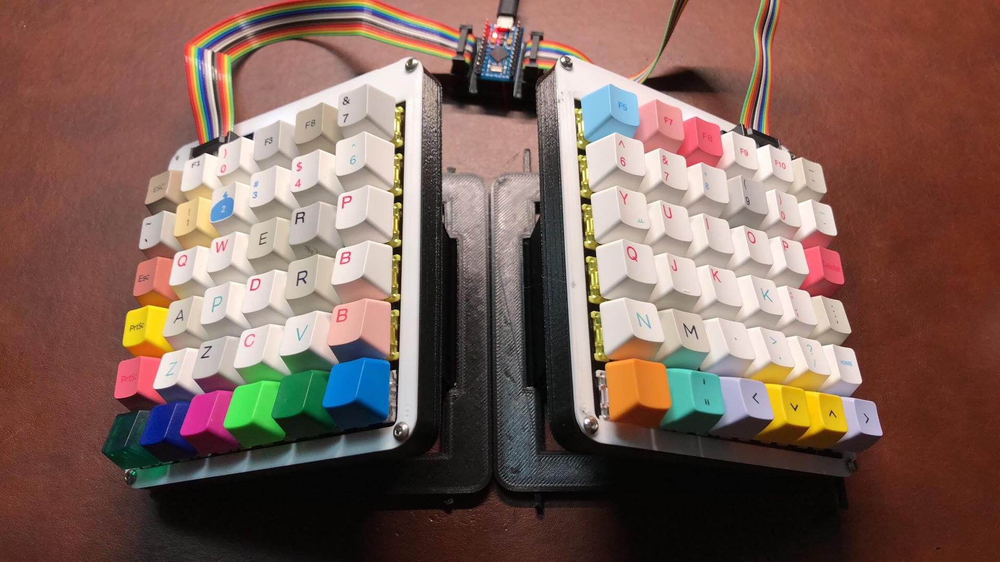
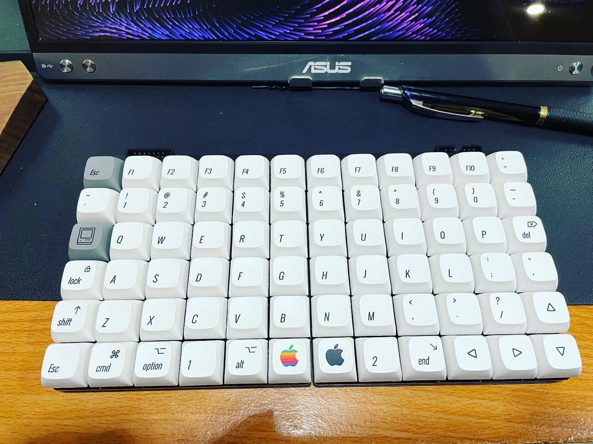
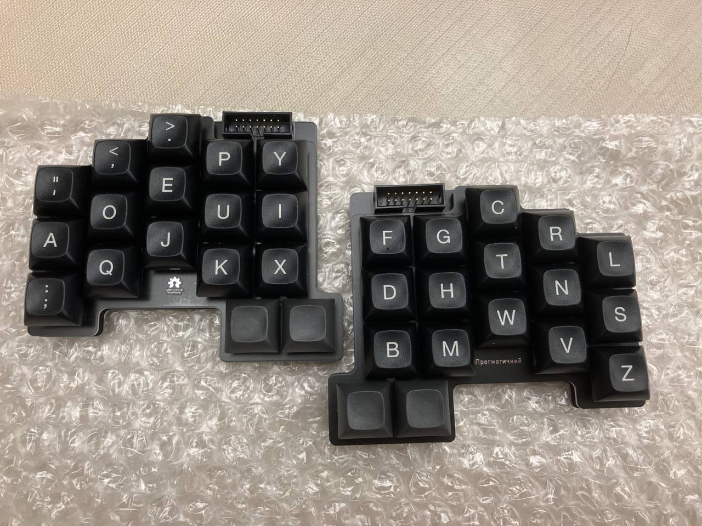

# Pragmatic Keyboard Kit

**Pragmatic 務實鍵盤** 是一個分離式鍵盤套件，有數字列，有方向鍵與功能列。支援VIAL與QMK，輕鬆調整鍵盤配置，是分離式鍵盤的基本款。

# 務實主義

本套件的開發將會務實的採用[敏捷流程](http://theleanstartup.com)，每次都發佈最小可行硬體套件，然後讓大家一起討論，看看如何讓這個鍵盤變得更好用。

換言之，這將是一把大家一起設計的鍵盤，而設計的原則就是「 **務實** 」，只加入使用的功能，降低開發的時間與成本；使用最少的硬體，達到最好的效果。

在嘗試了超多款鍵盤與超級多的[人體工學研究](https://youtu.be/p7gZdOTpbP8)之後，上週我無意間試做了分離式鍵盤的始祖直排[Let's split](https://github.com/nicinabox/lets-split-guide)，不得了！！！這實在太好用了，**務實，一整個好用。**

首先直排讓手指可以**自然的上下移動，減少手指的負擔**，讓使用者不會過勞。分離式鍵盤可以顯著改善腰酸背痛的辦公室症候群。自己改用了分離式鍵盤以後，背痛就減輕八成(個人經驗)。

**總鍵數達到72個，但是使用的空間卻比60%鍵盤還小**，實在是太神奇了。因此我才會想要開啟這個專案。

務實的設計目標是用最少的晶片做出可分離的鍵盤。不同於一般的分離式鍵盤需要兩個控制板，務實鍵盤只需要用到一個控制板。

**Pragmatic 務實鍵盤**是100%開源的，全程使用開源電路軟體KiCad設計，讓大家可以隨意改出符合自己需求的版本。要實踐一把務實鍵盤，需要以下的材料：

- 務實鍵盤電路板套組，如上圖：
  - 電路板 * 3片：主控、左手、右手。
  - 壓克力定位板 * 2片
  - 消音泡棉 * 2片
  - 排線 * 2條

- 套組不含
   - [Pro Micro](https://www.sparkfun.com/products/12640)或相容的開發
   - 軸
   - 鍵帽
   - 願意打破傳統的心（對，就是你！）

# 預設配置

# [使用手冊](START.md)

# FAQ

說明影片

## 分離式鍵盤會不會很難適應？
老實說，這絕對不是一天就可以適應的，但是[鍵人谷](https://www.facebook.com/groups/1111882339005914)太多人換過鍵盤了，都可以提供很多方法。我自己會建議每天[keybr.com](keybr.com)練習15分鐘，慢慢打，求正確度，不用擔心速度。一到兩週就可以上手了，從此人生就改變了?!

## 拇指好按嗎？
內行人，其實我的右手很弱，打字一整天右手就會開始痛。然後我開始做鍵盤配置與手的解剖學研究，才發現到拇指不應該大量使用

## 組裝好之後，桌面到鍵帽(假設是高軸加上XDA鍵帽)的厚度如何？
24mm 我也是用XDA。應該說，因為我不用QWERTY配置，導致我只有XDA可以使用。

## 可以改鍵盤配置嗎？
本鍵盤支援[QMK](https://qmk.fm)與[Vial](https://get.vial.today)，讓你為所欲為。

## 可以給一下目前您用的定義嗎？
我的配置。我平常寫C, Python,最近寫Tex😅 打字的話，漢語拼音佔九成，英文一成。

而且我喜歡用鉛筆做記號，方便我快速修改配置。你可以在此[下載空白板(PDF)](media/pragmatic%2034%20layout%20sheet.pdf)。

## 關於小鍵盤使用比較複雜的指令，比如說 <kbd>Ctrl</kbd>+<kbd>C</kbd>，<kbd>Command</kbd>+<kbd>Space</kbd>這種橫跨多個 Layer 的情形，有甚麼比較好的處理方式嗎？設定Macro？

包括切換workspace，我都是做成左手快捷鍵。可以參考上圖左邊中間的配置，那是我的操作與數字層。

## 在咖啡廳使用會被搭訕嗎？
我不知道為什麼你要這麼問。但是我們也做了一個抽樣調查，正妹/天菜受訪者表示會想要瞭解這個新奇的鍵盤，而不是使用者別擔心。

# 安裝說明
1. 依照下圖順序排列

2. 接線方式

# Vial使用方式

1. 下載[Vial](https://get.vial.today)
2. 下載[設定檔](https://github.com/jamessa/qmk_firmware/raw/jsa/keyboards/pragmatic/keymaps/vial/vial.json)。*按<kbd>Control</kbd>+滑鼠主鍵另存新檔即可。*
3. 開啟「Vial」，選擇「File」>「Sideload VIA JSON...」
4. 然後選取剛剛的設定檔，就可以開始修改配置了。

# 更新韌體
1. 下載最新的[QMK Toolbox](https://github.com/qmk/qmk_toolbox/releases/latest)與[務實韌體](https://github.com/jamessa/Pragmatic/releases/latest)
2. 開啟「Vial」，備份目前的配置。「Vial」->「Save current layout」。
2. 開啟QMK toolbox，選取剛剛下載的韌體，並且勾選*Auto-Flash*。
3. 按下控制板上面小小的Reset按鈕，這樣就更新完成了。

# Inspired by

- [34 key layout](Seniply https stevep99 github io seniply by Stevenp99)
- [Let's split](https://github.com/nicinabox/lets-split-guide)
- [GH36](https://geekhack.org/index.php?topic=61306.0)
- [Nyquist/Levison Keyboard](https://keeb.io/products/nyquist-keyboard)
- Xah lee [Why function keys are useful!](http://xahlee.info/kbd/keyboard_function_keys.html)
- Quasimode https://en.wikipedia.org/wiki/Mode_(user_interface)
- Mode slips and low discoverability. https://www.nngroup.com/articles/modes/

# 想知道更多

[臉書討論](https://www.facebook.com/groups/1111882339005914/posts/1790356644491810) 或 加入[Telegram群組](https://t.me/joinchat/qp7NLK_H0vY2MjA1)

# Changelog
- 2022-08-08 Refactor folder structure.
- 2022-08-05 Pragmatic 34 R2.
- 2022-06-11 V3.1 Controller with OLED.
- 2022-03-18 V3 with [3 form factor](https://www.facebook.com/groups/1111882339005914/posts/1883231691870971/)
- 2022-03-02 V2 Hotswap
- 2022-01-09 改用 Kicad 6
- V0.4 改回ProMicro腳位，增加相容性。
- V0.3 改為Elite-C腳位，重新定義IDC connector的腳位。
- V0.2 改為雙面版。
- V0.1 開始。

## Gallery

Pragmatic 72 [Tent Case](https://www.thingiverse.com/thing:5178752) designed by [Botio! Studio](https://botiostudio.com)

 Pragmatic 72 by Bart.

 Pragmatic 34 with [ADA keycaps](https://drop.com/buy/tex-ada-keycap-set) by Sean
