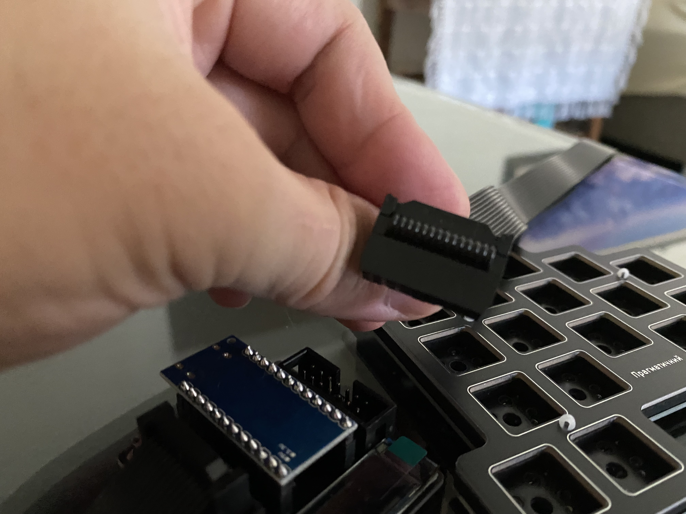

# 組裝

### 務實56
組裝影片

[](https://youtu.be/EOoOmIPXUWc)

### 務實34、60、75

1. 認識你的鍵盤。一把務實鍵盤由一塊主控板與兩片手板組成。


1. 將開發板安裝到主控板上。注意Type C接口朝上。


1. 將排線插入主控板。注意排線有卡榫，要依照卡榫方向安裝。




1. 將排線插入手板。


1. 完成品。


## 測試

1. 接上電腦後會顯示
```
Pragmatic
-= 34 =-
```


1. 安裝 Vial.app，打開後開啟Matrix Tester頁面


1. 用導電物，譬如鑷子或是杜邦線依序輕觸熱插拔座的兩端。也可以直接把軸一個個裝上去，邊裝邊測試。


1. 如果每一個按鍵都亮起來了，就是測試成功了。


## 使用

打開 Vial.app 的 Keymap頁面，預設的英文輸入法是Colemak DHM


修飾鍵 Modifiers
- `LGui_T(D)`：表示長按就是左Gui鍵，按一下是<kbd>D</kbd>。Gui鍵在macOS就是<kbd>⌘</kbd>，在Windows就是<kbd>⊞</kbd>
- `LSft_T(C)`：表示長按就是左<kbd>Shift</kbd>，按一下是<kbd>C</kbd>。
- `LCtl_T(X)`：表示長按就是左<kbd>Control</kbd>，按一下是<kbd>X</kbd>。
- `LAlt_T(Z)`：表示長按就是左<kbd>Alt</kbd>，按一下是<kbd>Z</kbd>。

層鍵 Layer Keys
- `LT1(Bksp)`：表示長按Long Tap會切到第1層，按一下是<kbd>Backspace</kbd>。
- `LT2(Space)`：表示長按會切到第2層，按一下是<kbd>Space</kbd>。
- `LT3(Caps Lock)`：表示長按會切到第3層，按一下是<kbd>Caps Lock</kbd>。
- `LT4(Enter)`：表示長按會切到第4層，按一下是<kbd>Enter</kbd>。

# 改

要修改前，記得先把目前的配置存起來，Vial.app -> File -> Save Current Layout。

如果遇到問題，都可以直接到(Telegram Group](https://t.me/+qp7NLK_H0vY2MjA1)詢問喔。


> "If computer is the bicycle to the mind, keyboard is the pedal.", James Sa, creator of Pragmatic keyboard.
